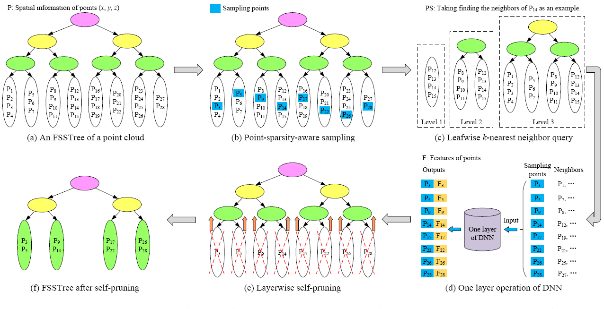

# Accelerate Point Cloud Structuring for Deep Neural Networks via Fast Spatial-Searching Tree

Created by Jinyu Zhan, Shiyu Zou, Wei Jiang, Youyuan Zhang, Suidi Peng, Ying Wang



Fig.1 An example of structuring points by FSSTree-PCS for one layer of DNN. (a) An FSSTree of a point cloud is constructed. (b) Sampling points are fairly sampled from each leaf node of FSSTree, and (c) then the neighbor points of each sampling point are searched according to the similarity level between leaf nodes. (d) The sampling points and their neighbors are fed to one DNN layer to obtain the local features of sampling points. (e) After one layer operation of DNN, the FSSTree automatically moves the sampling points from the leaf nodes to their parent nodes, and then deletes the leaf nodes. (f) The pruned FSSTree supports for the sampling and neighbor query of the next DNN layer.

# Introduction

We design a novel data structure, i.e., Fast Spatial-Searching Tree (FSSTree), to accelerate point cloud structuring for DNNs on embedded devices. The FSSTree is constructed based on density distribution of point clouds to achieve semantic segmentation, which can guarantee that points with similar spatial positions are stored in adjacent storage sets. Based on FSSTree, we propose a point-sparsity-aware sampling method and a leafwise k-nearest neighbor query method to reduce the computation overhead of structuring point clouds. Meanwhile, the point-sparsity-aware sampling method achieves fair sampling on both dense and sparse parts, which can overcome the nonuniform distribution of point clouds caused by occlusion, lighting and other factors. The leafwise k-nearest neighbor query method skips a large number of dissimilar points to quickly obtain the neighbor points, which can significantly reduce the search scope. We also present a layerwise self-pruning algorithm to automatically adjust the FSSTree after each layer’s operation to match the hierarchical architecture of DNNs. Finally, we conduct extensive experiments on KITTI, S3DIS and ModelNet40 datasets and three devices (including an RTX 3090 server, a Jetson AGX Xavier and an Apple M2). The experimental results demonstrate the efficiency of our approach, which can reduce the time overhead by up to 97.46% compared with the traditional combination of FPS (Farthest Point Sampling) and KNN (k-Nearest Neighbor).


# Usage

The main functions are in PC_FSSTree.py. 

### TFSSTree construction

```
data = np.random((80000,3))             # Initialize a numpy array for a randomly sized point cloud 
e = 3                                 # Set the expansion coefficient e 
k = 256                               # Set the neighbor query size k 
h = math.floor(math.log((data.shape[0] / (math.log(data.shape[0],10)* self.k)), 2)) + 1
# h is the height of the tree is a hyperparameter which can be obtained by the equation we recommend. You can also adjust it manually to make the task work best.
# Each layer of FSSTree needs to choose a dimension (i.e., X-axis, Y-axis or Z-axis), where 0 denotes X-axis, and 1 denotes Y-axis, and 2 denotes Z-axis. The dimension with the biggest variance is chosen as the dim of the first layer, and then the dimension with the second biggest variance is chosen as the dim of the second layer, and so on, until the last layer.

dim = [0,1,2,0,1,2,0,1,2,0,1,2,0,1,2,1,2,0,1,2]  # The length of dim is h. 
# To create an FSSTree. 
t = PC_FSSTree(data=data, slip_mode="kde", level=h , dim = dim,k=k,ek=e*k)
```

### FSSTree-based sampling

```
samp = int(data.shape[0]/4)                # Set the number of sampling points for the current DNN layer.
t.sampled_points(samp)                   # Perform FSSTree-based sampling.
fsst_sample_data_numpy = np.array(t.data[t.s_points_index]).astype(np.float32)  #The sampling points are obtained. 

```


###  FSSTree-based neighbor query

```
k = 256    # Set the neighbor query size k 
neighbor_query_reesult = t.fsstree_knn(fsst_sample_data_numpy,k=k)  
#Perform FSSTree-based neighbor query and sampling points obtained in the previous step are in fsst_sample_data_numpy. 

```


### FSSTree self-pruning after each layer operation of DNN
```
t.delete_layer()  # Perform FSSTree self-pruning after each layer operation of DNN.

```


### The whole process of FSSTree-based point cloud structuring. PS: The code example is in the next section and the pseudo code is as follows.
```
input ：pc [b,n,3]  # Input points
e = 3                                 
k = 256                              
h = math.floor(math.log((data.shape[0] / (math.log(data.shape[0],10)* self.k)), 2)) + 1
dim = [0,1,2,0,1,2,0,1,2,0,1,2,0,1,2,1,2,0,1,2] 
t = PC_FSSTree(data=data, slip_mode="kde", level=h , dim = dim,k=k,ek=e*k)

for each DNN layer    # Here is just to simplify the demonstration, the actual neural networks are not like this.
  samp = int(pc.shape[0]/4)
  t.sampled_points(samp)                   
  fsst_sample_data_numpy = np.array(t.data[t.s_points_index]).astype(np.float32) 
  neighbor_query_reesult = t.fsstree_knn(fsst_sample_data_numpy,k=k)
  # Perform the operations of neural network.
  pc = DNN.layer[i].forward(pc,fsst_sample_data_numpy,neighbor_query_reesult)
  t.delete_layer()
return pc
```

# Code Example
Taking PointNet++ as an example, the main modification is to modify the sample_and_group function in pointnet_util.py. Then recursively call the method in the neural network.

Different point cloud structuring methods have different solutions, and our FSSTree-based point cloud structuring method only needs to sequentially insert the codes of tree construction, sampling, neighbor query, and self-pruning.

```
def sample_and_group(e,tree_list,npoint, radius, nsample, xyz, points, returnfps=False,):
    B, N, C = xyz.shape
    S = npoint
    s_data = []
    k_data = []
    search_node_list = []
    current_point_global_index = []
    k_idx = []
    device = xyz.device
    for i in range(B):
        t = tree_list[i]  # Create an FSSTree
        current_point_global_index.append(t.index)
        t.sampled_points(npoint)  # FSSTree-based sampling.
        sampled_data_numpy = np.array(t.data[t.s_points_index]) # (npoint,3)
        s_data.append(sampled_data_numpy)
        knn_reesult= t.fsstree_knn(sampled_data_numpy,k=nsample)   # FSSTree-based neighbor query.
        k_idx.append(np.array([t.index_map[int(idx)] for idx in knn_reesult.reshape(-1)]).reshape(-1,nsample))
        knn_data_numpy = np.array(t.data[knn_reesult]) #(npoint,nsample,3)
        k_data.append(knn_data_numpy)
        t.delete_layer()  # FSSTree self-pruning.
    new_xyz = torch.from_numpy(np.array(s_data))   # tensor(6,1024,3) 
    grouped_xyz = torch.from_numpy(np.array(k_data))  # [B, npoint, nsample, C]
    grouped_xyz_norm = grouped_xyz - new_xyz.view(B, S, 1, C)
    k_idx = torch.from_numpy(np.array(k_idx))
    current_point_global_index = np.array(current_point_global_index)
    if points is not None:
        grouped_points = index_points(points, k_idx)
        new_points = torch.cat([grouped_xyz_norm.to(device), grouped_points.to(device)], dim=-1)  # [B, npoint, nsample, C+D]
    else:
        new_points = grouped_xyz_norm
    if returnfps:
        return new_xyz, new_points, grouped_xyz
    else:
        return new_xyz, new_points
```

# Reproducibility Guidelines

- Environment Setting：Run the following command to install the required dependencies.
  conda env create -f env.yml
- Some notes:
  
1.Tips on choosing the dim: In some real-life scenarios, points in the Z-axis (i.e., vertical direction) are clustered distribution, and the density distribution curve has no obvious peaks or valleys. In this case, we can only divide the points in the X-axis and Y-axis. For example, dim=[0,1,0,1,0,1].

2.The height of FSSTree in the equation is only a recommended value and can be adjusted according to the distribution of points in the real-life scenarios.

3.Multiple threads can be set to improve the process of FSSTree construction according to the device performance. 
